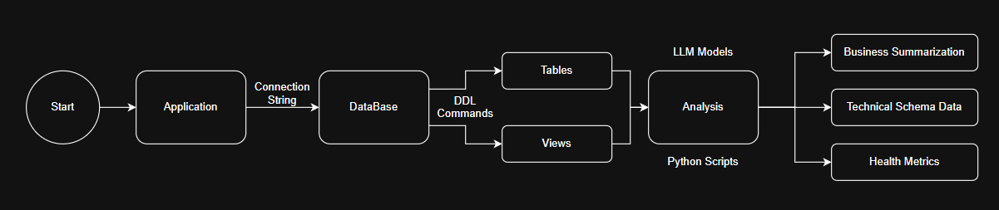

# Intelligent_Data_Dictionary_Agent
Project Repository for HackFest 2.0 GDG New Delhi

## Application Architecture

## Execution Instructions

**-Model**

ollama pull llama3 // If not done Previously

ollama serve

**-Frontend**

cd frontend

npm run dev

**-Backend**

cd backend

python main.py
